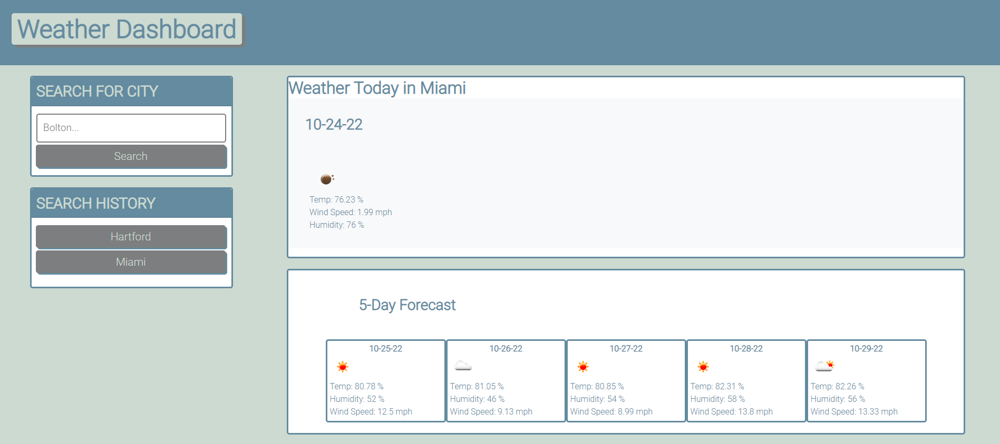
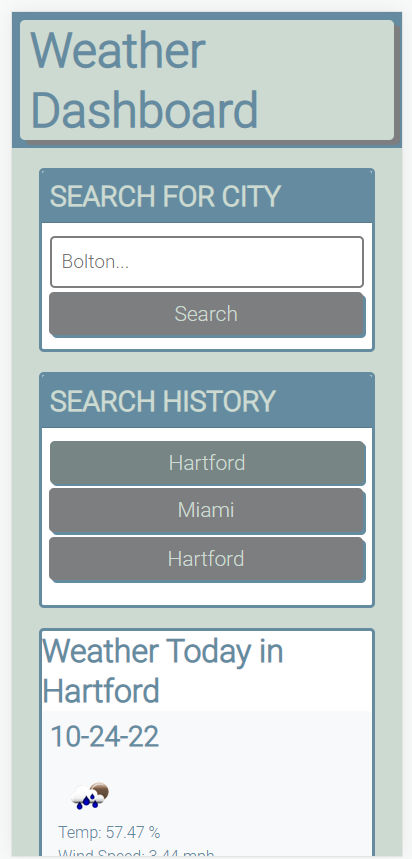

# Whats-Up-Weather
## Description
Whats Up Weather uses a third party API from Open Weather to request weather data from cities searched. Users will be able to search for a city and see the current weather in addition to the five day forecast. A users search history is saved in local storage and added to a search history list as a button which can render the search data for that city.  

## Access

<!-- Deployed weblink-->

The Whats Up Weather webpage can be accessed at the following URL...

https://lynnadelesadler.github.io/Whats-Up-Weather/

The URL of the GitHub repository ...

https://github.com/lynnadelesadler/Whats-Up-Weather

## Visuals

<!-- Provide the visuals for full display and phone display -->
This is how the deployed Whats Up Weather website will look on a full display computer screen.

This is how the deployed Whats Up Weather website will look on a cell phone.

## Usage
- When a user opens the Whats Up Weather website a search bar is available.

  - Type in any City to render the weather.

- The current weather conditions for the city will display with the values of...
    - date
    - temperature
    - humidity
    - wind speed
    - weather condition icon

- The five day forecast for that city will also display below the current weather conditions showing the values of...
    - date
    - temperature
    - humidity
    - wind speed
    - weather condition icon

- Each City that is searched will be saved to local storage and added to a Search History list.
  - Each city in the search history list has an attribute of a button.
  - When the City button is clicked the weather forecast will render to the page again. 

_Here you will see a demonstration on how the Whats Up Weather website works._

## Support
For help with this webpage please contact
|Name | Email |
|-----------|---------------------------|
|Lynn Sadler| lynnadelesadler@yahoo.com |

## Roadmap
Check back to this page as enhancements could be made for usability and optimized display.

## Authors and acknowledgment
Some HTML and CSS credit to be given to © 2022 Trilogy Education Services, LLC, a 2U, Inc. brand. as I referenced some of our class activities as a start to build upon my project. 

Primary credit to be given to Lynn Sadler JavaScript file optimized and enhanced code credit credit given to Lynn Sadler.

Acknowledgement to Uconn Full Stack Web Developer Bootcamp, Teachers and Teacher assistants for supporting me on my developer journey!

Acknowledgment to third party API from Open Weather for providing the data we are searching for. 

## License
N/A